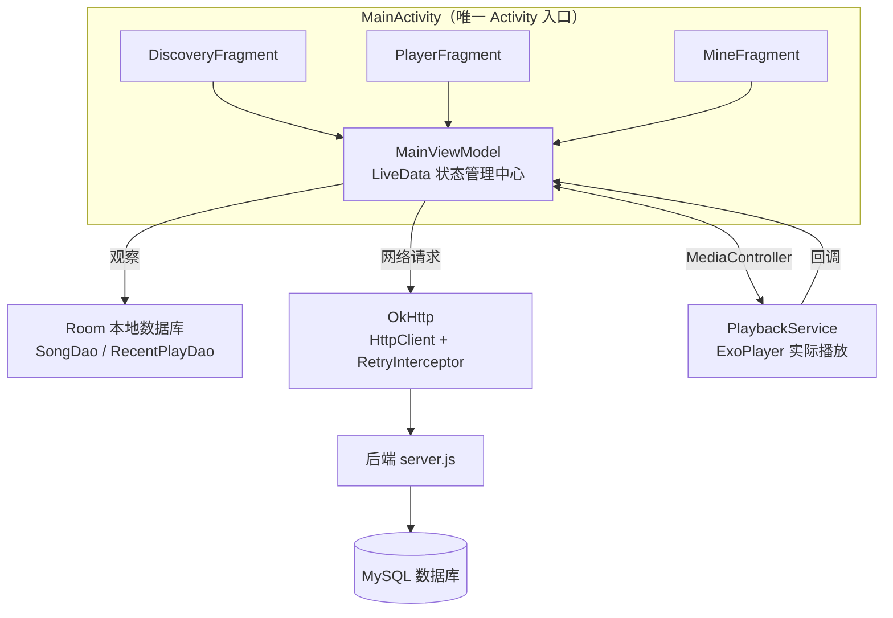
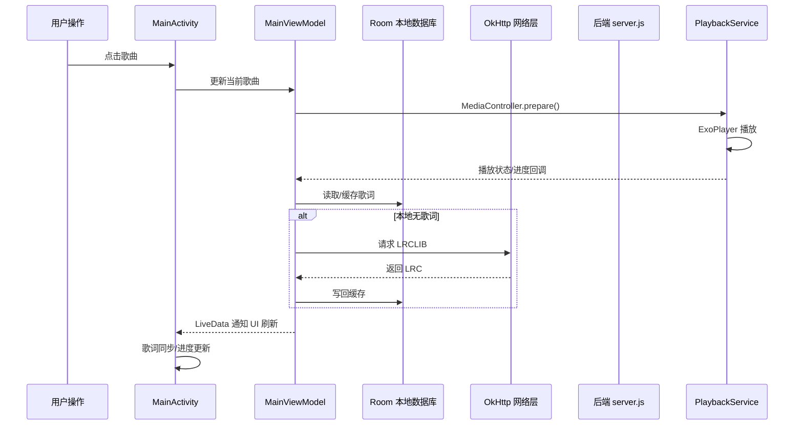

# 🎵 MusicPlayer

> 一套前后端分离的 Android 音乐播放器，包含 Android 客户端、Node.js 后端和 MySQL 数据存储。围绕在线听歌、本地管理、歌词同步、用户系统和版本更新，实现了一套接近真实产品形态的音乐应用基础能力。


---

## 📚 目录

- [✨ 项目亮点](#-项目亮点)
- [🎯 核心功能](#-核心功能)
- [🛠️ 技术栈](#️-技术栈)
- [📁 项目结构](#-项目结构)
- [🏗️ 架构设计](#️-架构设计)
- [🚀 快速开始](#-快速开始)
- [⚙️ 配置说明](#️-配置说明)
- [📡 API 接口文档](#-api-接口文档)
- [📊 数据库设计](#-数据库设计)
- [💡 核心技术亮点](#-核心技术亮点)
- [🎨 主题系统](#-主题系统)
- [🔄 典型使用流程](#-典型使用流程)
- [🧪 测试](#-测试)
- [⚠️ 已知问题与待优化](#️-已知问题与待优化)
- [📄 相关文档](#-相关文档)
- [🙏 致谢](#-致谢)

---

## ✨ 项目亮点

- **完整业务闭环**：从发现歌曲、搜索、播放、歌词、收藏、下载，到账号登录、资料维护、版本更新，链路完整。
- **在线与本地双栈能力**：既支持服务端歌曲流式播放，也支持下载歌曲和用户手动导入本地音频统一管理。
- **后台持续播放**：基于 Media3 `MediaSessionService + ExoPlayer`，支持通知栏控制、音频焦点处理、耳机拔出自动暂停。
- **歌词体验突出**：支持 LRCLIB 歌词获取、LRC 解析、缓存复用，并结合播放进度进行实时同步显示。
- **启动体验友好**：采用"本地缓存先展示，远程数据后台同步"的双层数据策略，减少白屏并保留收藏、本地路径等状态。
- **展示效果完整**：全屏播放器包含黑胶旋转、背景模糊、动态取色、歌词滚动等视觉细节，适合作为课程设计、毕业设计或作品集项目展示。

---

## 🎯 核心功能

| 模块 | 能力 |
|------|------|
| 🎧 音乐播放 | 在线流媒体播放（HTTP Range 断点续传）、本地音乐播放、完整播放控制、循环模式切换、前台服务后台播放 |
| 📝 歌词系统 | LRC 格式解析、200ms 定时器 + 二分查找实时同步、智能缓存（500 条/30 天）、LRCLIB 集成、交互式歌词跳转 |
| 🎨 视觉体验 | 深色/浅色主题、Palette 动态取色、毛玻璃效果、黑胶唱片动画、共享元素过渡、Lottie 动画 |
| 👤 用户系统 | JWT 认证（7 天有效期）、资料管理、bcrypt 密码加密、登录状态持久化 |
| 📚 音乐库管理 | 发现页、分类浏览、本地搜索、收藏功能、最近播放（7 天窗口）、累计听歌数、歌曲下载、本地导入 |
| 🔄 版本更新 | 启动自动检查、手动检测、APK 下载安装 |

---

## 🛠️ 技术栈

### 前端（Android）

| 技术 | 版本 | 用途 |
|------|------|------|
| **Media3 (ExoPlayer)** | 1.5.1 | 音视频播放引擎、UI 控件、MediaSession 服务 |
| **Room Database** | 2.8.4 | 本地 SQLite ORM 框架 |
| **OkHttp** | 4.12.0 | HTTP 网络请求（含重试机制） |
| **Coil** | 2.7.0 | Kotlin 协程图片加载库 |
| **Gson** | 2.11.0 | JSON 序列化/反序列化 |
| **Palette** | 1.0.0 | 从图片提取主色调 |
| **Lottie** | 6.4.0 | Airbnb 矢量动画渲染 |
| **Material Components** | 1.12.0 | Material Design 3 UI 组件 |
| **opencc4j** | 1.14.0 | 简繁体中文转换 |

### 后端（Node.js）

| 技术 | 版本 | 用途 |
|------|------|------|
| **Express** | ^4.18.2 | Web 应用框架 |
| **MySQL2** | ^3.6.0 | MySQL 驱动（连接池模式） |
| **bcryptjs** | 实际运行依赖 | 密码哈希加密 |
| **jsonwebtoken** | 实际运行依赖 | JWT 生成与验证 |
| **Nodemon** | ^3.0.1 | 开发热重载工具 |

### 数据库

- **远程数据库**：MySQL（`musicplayer` 数据库）
- **本地数据库**：Room SQLite（`music_db`，版本 10）
- **账号音乐库表**：`user_favorites`、`user_recent_plays`

> [!WARNING]
> `web/server.js` 已实际使用 `bcryptjs` 和 `jsonwebtoken`，但这两个包当前尚未写入 `web/package.json`，首次启动前需要手动安装：`npm install bcryptjs jsonwebtoken`。

---

## 📁 项目结构

```text
MusicPlayer/
├─ app/                                # Android 客户端
│  ├─ build.gradle.kts
│  └─ src/main/
│     ├─ AndroidManifest.xml
│     ├─ java/com/example/musicplayer/
│     │  ├─ app/                       # Application 初始化
│     │  ├─ core/                      # 常量、网络、歌词、主题等核心能力
│     │  │  ├─ lyrics/                 # LrcLibService / LyricUtils / LyricCacheManager / ChnConverter
│     │  │  ├─ network/                # HttpClient / RetryInterceptor / ApiResponse
│     │  │  ├─ theme/                  # ThemeManager
│     │  │  ├─ Constants.java
│     │  │  ├─ ErrorHandler.java
│     │  │  ├─ Logger.java
│     │  │  └─ ToastHelper.java
│     │  ├─ data/                      # Room 数据库与数据模型
│     │  │  ├─ local/                  # AppDatabase / SongDao / RecentPlayDao
│     │  │  └─ model/                  # Song / RecentPlay / User / LyricEntry
│     │  └─ feature/                   # 业务模块
│     │     ├─ auth/                   # 登录注册与用户管理
│     │     ├─ discovery/              # 发现页与分类浏览
│     │     ├─ library/                # 收藏、本地、最近播放、导入音乐
│     │     ├─ main/                   # MainActivity / MainViewModel
│     │     ├─ player/                 # 播放器、下载、播放服务
│     │     ├─ profile/                # 个人中心与设置
│     │     ├─ search/                 # 搜索页
│     │     └─ update/                 # 版本更新
│     └─ res/                          # 资源文件
├─ web/                                # Node.js 后端
│  ├─ server.js
│  ├─ package.json
│  ├─ sql/users.sql
│  ├─ index.html
│  └─ 404.html
├─ PROJECT_INTRODUCTION.md             # 项目介绍书（适合答辩/汇报）
├─ DEPLOYMENT_GUIDE.md                 # 部署与上线说明
├─ CLAUDE.md                           # 开发者视角的架构速览
└─ database_indexes.sql                # MySQL 查询优化索引脚本
```

---

## 🏗️ 架构设计

### MVVM + 单 Activity 多 Fragment



### 数据流架构



> [!TIP]
> 采用"**本地缓存优先 + 远程补全**"策略：启动时先从 Room 读取数据避免白屏，后台再请求服务端同步合并，同步过程使用 `IGNORE` 策略保护本地状态（收藏、下载路径、导入标记、歌词缓存）。

---

## 🚀 快速开始

### 环境要求

| 端 | 要求 |
|----|------|
| **Android 端** | Android Studio 较新版本、JDK 17 运行 Gradle、`compileSdk 35` / `minSdk 31`、Gradle Wrapper |
| **后端** | Node.js 16+、MySQL 5.7+ 或 8.0+ |

### 1️⃣ 克隆项目

```bash
git clone https://github.com/your-username/MusicPlayer.git
cd MusicPlayer
```

### 2️⃣ 后端部署

```bash
cd web
npm install
# 首次启动前补装未声明的依赖
npm install bcryptjs jsonwebtoken
```

创建并初始化 MySQL 数据库：

```sql
CREATE DATABASE musicplayer CHARACTER SET utf8mb4 COLLATE utf8mb4_unicode_ci;
```

```bash
# 导入用户/偏好/收藏/最近播放表结构
mysql -u your_username -p musicplayer < sql/users.sql

# 可选：补充查询优化索引
mysql -u your_username -p musicplayer < ../database_indexes.sql
```

启动服务器：

```bash
npm run dev    # 开发模式（自动重启）
npm start      # 生产模式
```

服务器将在 `http://localhost:3000` 启动。

> [!IMPORTANT]
> 当前后端配置直接写在 `web/server.js` 中（端口 `3000`、JWT Secret、MySQL 连接信息、静态资源目录 `/musicplayer`），未抽离到 `.env`。本地部署前请先修改这些配置。

### 3️⃣ Android 端配置

**配置签名密钥**：在项目根目录创建 `keystore.properties`：

```properties
keystore.path=path/to/your.keystore
keystore.password=your_password
keystore.alias=your_alias
keystore.keyPassword=your_key_password
```

**修改 API 地址**（如后端不在默认地址）：优先检查以下文件：

- [Constants.java](app/src/main/java/com/example/musicplayer/core/Constants.java) → `API.BASE_URL`
- [MainViewModel.java](app/src/main/java/com/example/musicplayer/feature/main/MainViewModel.java)
- [UpdateManager.java](app/src/main/java/com/example/musicplayer/feature/update/UpdateManager.java)

```java
public static final class API {
    public static final String BASE_URL = "http://your-server-ip:3000";
}
```

**同步 Gradle**：在 Android Studio 中打开项目，等待 Gradle 同步完成。

### 4️⃣ 运行应用

1. 连接 Android 设备或启动模拟器
2. 点击 Android Studio 的 ▶️ Run 按钮
3. 应用将安装并自动启动

---

## ⚙️ 配置说明

### Android 端权限

| 权限 | 用途 |
|------|------|
| `INTERNET` | 网络请求 |
| `FOREGROUND_SERVICE` / `FOREGROUND_SERVICE_MEDIA_PLAYBACK` | 后台播放 |
| `POST_NOTIFICATIONS` | 通知权限 |
| `REQUEST_INSTALL_PACKAGES` | APK 更新安装 |

同时还声明了 `FileProvider`，用于更新下载后的 APK 安装流程。

### 网络与资源

> [!CAUTION]
> - Android 端默认使用明文 HTTP，清单中开启了 `usesCleartextTraffic="true"`。
> - 后端通过 `/resource` 和 `/musicplayer` 暴露静态文件，资源根目录默认写死为 `/musicplayer`。如果本地没有该目录，歌曲和图片资源访问会失败。

### 关键常量

| 常量 | 值 | 说明 |
|------|----|----|
| `API.CONNECT_TIMEOUT` | 15s | 连接超时 |
| `API.READ_TIMEOUT` | 30s | 读超时 |
| `API.WRITE_TIMEOUT` | 30s | 写超时 |
| `API.MAX_RETRY_COUNT` | 3 | 最大重试次数 |
| `Cache.LYRIC_CACHE_SIZE` | 500 | 歌词内存缓存条数 |
| `Cache.LYRIC_CACHE_EXPIRE_TIME` | 30 天 | 歌词缓存过期时间 |
| `Playback.PROGRESS_UPDATE_INTERVAL` | 200ms | 播放进度更新间隔 |
| `Playback.DISK_ROTATION_DURATION` | 10000ms | 黑胶旋转一周时长 |

---

## 📡 API 接口文档

### 用户认证

| 方法 | 路径 | 认证 | 说明 |
|------|------|------|------|
| POST | `/api/user/register` | 否 | 用户注册 |
| POST | `/api/user/login` | 否 | 用户登录（返回 JWT） |
| GET | `/api/user/profile` | 是 | 获取当前用户资料 |
| PUT | `/api/user/profile` | 是 | 更新用户资料 |
| POST | `/api/user/change-password` | 是 | 修改密码 |
| POST | `/api/user/delete` | 是 | 注销账号 |
| POST | `/api/user/upload-avatar` | 是 | 上传头像（base64） |

### 用户音乐库

| 方法 | 路径 | 认证 | 说明 |
|------|------|------|------|
| GET | `/api/user/library` | 是 | 获取当前账号的收藏、最近播放和累计听歌数 |
| POST | `/api/user/favorites` | 是 | 设置收藏/取消收藏 |
| POST | `/api/user/recent-play` | 是 | 上报最近播放记录并更新累计听歌数 |
| DELETE | `/api/user/recent-play/:songId` | 是 | 删除某首歌的最近播放记录 |

### 音乐数据

| 方法 | 路径 | 认证 | 说明 |
|------|------|------|------|
| GET | `/api/songs` | 否 | 分页获取歌曲列表 |
| GET | `/api/songs/all` | 否 | 获取全部歌曲 |
| GET | `/api/song/detail?id=` | 否 | 单首歌曲详情 |
| GET | `/api/song/search?q=` | 否 | 搜索歌曲 |
| GET | `/api/song/play?id=` | 否 | 音频流播放（支持 Range） |

### 其他

| 方法 | 路径 | 认证 | 说明 |
|------|------|------|------|
| GET | `/api/app/version` | 否 | 应用版本检查 |

> [!NOTE]
> 详细 API 实现请查看 [server.js](web/server.js) 源码注释。

---

## 📊 数据库设计

### users 表（远程 MySQL）

| 字段 | 类型 | 约束 | 说明 |
|------|------|------|------|
| id | INT | PK, AUTO_INCREMENT | 主键 |
| username | VARCHAR(50) | NOT NULL, UNIQUE | 用户名 |
| email | VARCHAR(50) | NOT NULL, UNIQUE | 邮箱 |
| password | VARCHAR(255) | NOT NULL | bcrypt 加密密码 |
| nickname | VARCHAR(50) | DEFAULT '' | 昵称 |
| avatar | VARCHAR(255) | DEFAULT '/resource/img/default_avatar.jpg' | 头像路径 |
| phone | VARCHAR(20) | DEFAULT '' | 手机号 |
| gender | TINYINT | DEFAULT 0 | 性别（0未知/1男/2女） |
| birthday | DATE | DEFAULT NULL | 生日 |
| status | TINYINT | DEFAULT 1 | 状态（0禁用/1正常） |
| created_at | DATETIME | DEFAULT CURRENT_TIMESTAMP | 创建时间 |
| last_login_at | DATETIME | DEFAULT NULL | 最后登录时间 |

**索引**：`idx_username`、`idx_email`、`idx_status`

### songs 表（远程 MySQL）

| 字段 | 类型 | 说明 |
|------|------|------|
| id | INT | PK |
| title | VARCHAR | 歌曲标题 |
| artist | VARCHAR | 作曲家/艺术家 |
| singer | VARCHAR | 歌手 |
| photo | VARCHAR | 封面图路径 |
| url | VARCHAR | 音频文件路径或 URL |
| duration | INT | 时长（秒） |
| album | VARCHAR | 专辑名 |
| lrc_id | BIGINT | LRCLIB 歌词 ID |
| created_at | DATETIME | 创建时间 |

**索引**：`idx_songs_title`、`idx_songs_singer`、`idx_songs_album`、`idx_songs_search`（组合）

### 本地 Room 数据库（`music_db`，版本 10）

**Song 实体**：`id`、`title`、`artist`、`singer`、`path`、`coverUrl`、`album`、`duration`、`isLocal`、`isFavorite`、`lrcId`、`lyrics`

**RecentPlay 实体**：`id`、`songId`、`timestamp`

**9 → 10 迁移新增索引**：`isLocal`、`isFavorite`、`lrcId`、`path`、`recent_plays.songId`、`recent_plays.timestamp`、`recent_plays(songId, timestamp)`

> [!TIP]
> 本地数据库的特点：
> - 最近播放 7 天滑动窗口自动清理
> - 支持本地模糊搜索（title/singer/album）
> - 收藏与最近播放在本地作为当前登录账号的缓存，由服务端快照覆盖同步

---

## 💡 核心技术亮点

### 1. 网络请求优化

- **OkHttp 单例模式**：双重检查锁定，连接复用
- **三级重试机制**：
  - OkHttp 内置连接级重试
  - 自定义 `RetryInterceptor`（3 次 + 线性退避）
  - 业务层异常捕获重试
- **超时配置**：连接 15s / 读写 30s

### 2. 歌词同步算法

```java
// 200ms 定时器 + 二分查找 O(log n)
// 实现 < 100ms 的歌词定位精度
private void updateLyricPosition() {
    int position = binarySearch(lyricEntries, currentPosition);
    if (position != currentPositionIndex) {
        lyricAdapter.setCurrentPosition(position);
        recyclerView.smoothScrollToPosition(position);
    }
}
```

### 3. 内存泄漏防护

- WeakReference Handler 避免 Activity 泄漏
- Fragment 销毁时取消图片请求/移除监听器/停止动画
- try-with-resources 确保网络响应释放
- 统一 `ToastHelper` 防止 Window 泄漏

### 4. 数据同步策略

- 远端 `songs` 表作为"权威数据源"
- 本地 Room 作为离线缓存 + 本地状态扩展
- `isLocal`、`lyrics` 等本地状态尽量保留，不被远程同步覆盖
- 收藏与最近播放采用"服务端账号数据 + 端侧缓存覆盖"的同步方式
- 本地下载与导入歌曲保持设备维度，不随账号切换被删除
- 批量同步使用 `IGNORE` 策略保护本地修改

### 5. 性能优化

- MySQL 连接池（最大 10 连接）
- 组合索引优化搜索性能
- Room LiveData 响应式查询
- Coil 图片加载 + crossfade 过渡
- Palette 异步提取主色调

---

## 🎨 主题系统

应用支持三种主题模式，可在 **设置 > 主题模式** 中切换：

| 模式 | 说明 |
|------|------|
| 🌞 浅色模式 | 白色背景 + 深色文字，适合日间使用 |
| 🌙 深色模式 | 近黑色背景 + 浅色文字，适合夜间/护眼 |
| 💻 跟随系统 | 自动跟随操作系统主题设置（默认） |

**快捷键**：连接键盘时按 `Ctrl+T` 可快速切换主题。

> [!TIP]
> 设计亮点：
> - 播放器界面统一采用深色沉浸式设计（`#121214`），不受全局主题影响
> - 所有 UI 元素在两种模式下均有良好的对比度和可读性
> - 平滑的主题过渡动画提升用户体验

---

## 🔄 典型使用流程

### 1. 启动与数据准备

1. 应用启动后先检查登录状态，未登录则进入登录页
2. 主界面优先从 Room 读取本地歌曲列表，避免启动白屏
3. 后台再请求服务端歌曲数据，同步并合并到本地数据库
4. 同步过程中尽量保留收藏、下载路径和导入状态等本地信息

### 2. 发现与播放

1. 用户在发现页浏览推荐歌曲或进入搜索页查找目标歌曲
2. 点击歌曲后，`MainActivity` 将歌曲转换为 `MediaItem` 并交给 `MediaController`
3. `PlaybackService` 中的 ExoPlayer 开始播放，通知栏同步出现播放控制
4. 播放状态、歌曲信息、进度和歌词通过 `MainViewModel` 分发给各页面

### 3. 歌词加载与同步

1. 播放开始后，优先读取数据库或缓存中的歌词
2. 若本地没有歌词，则请求 LRCLIB
3. 对导入歌曲，也会先显示"搜索歌词中..."，再按歌曲名/歌手/专辑/时长向 LRCLIB 搜索
4. 获取到 LRC 后解析为时间轴结构并写回本地数据库
5. 播放过程中根据当前进度定位歌词行，实现实时高亮与滚动同步

### 4. 收藏、下载与本地管理

1. 用户可在播放器或列表页直接收藏歌曲，收藏状态会同步到当前账号
2. 最近播放与累计听歌数会随播放过程同步到当前账号
3. 下载功能将歌曲保存到应用外部音乐目录，并通过通知栏展示进度
4. 下载完成后自动更新数据库，将该歌曲标记为设备本地文件
5. 用户也可手动导入本地音频，系统会和下载音乐分组展示，导入歌曲支持播放时自动搜索歌词

---

## 🧪 测试

当前测试覆盖率较低，建议补充以下核心模块的单元测试。

**已有测试**：

- ✅ `ThemeManagerTest` — 主题管理器基本功能

**待补充测试**：

- ⬜ `MainViewModel` — 数据同步逻辑
- ⬜ `SongDao` / `RecentPlayDao` — 数据库操作
- ⬜ `LyricUtils` — LRC 解析算法
- ⬜ `UserManager` — 用户认证流程
- ⬜ `DownloadManager` — 下载逻辑
- ⬜ `HttpClient` / `RetryInterceptor` — 网络重试机制

运行现有测试：

```bash
./gradlew testDebugUnitTest
```

---

## ⚠️ 已知问题与待优化

### 当前版本限制

> [!WARNING]
> - JWT Secret 硬编码，生产环境需改用环境变量
> - 后端配置仍然硬编码在 `web/server.js` 中，尚未抽离到 `.env`
> - 缺少 HTTPS/TLS 配置
> - 后端无请求频率限制（Rate Limiting）
> - ProGuard 未配置有效混淆规则
> - 测试覆盖率极低（< 5%）
> - `web/package.json` 未声明 `bcryptjs` 和 `jsonwebtoken`
> - 仓库中当前没有 `LICENSE` 文件
> - 账号隔离目前采用"服务端同步 + 本地缓存覆盖"，Room 本地表结构本身未直接按 `userId` 建模

### 建议优化项

- 🔧 补齐后端依赖声明并增加锁文件
- 🔧 引入 `.env` 配置替代硬编码
- 🔧 添加 HTTPS 支持
- 🔧 实现请求限流中间件
- 🔧 补充核心模块单元测试
- 🔧 配置 ProGuard 混淆规则
- 🔧 添加 CI/CD 自动化构建
- 🔧 集成 Crashlytics 错误监控
- 🔧 实现离线模式完整支持

---

## 📄 相关文档

- [PROJECT_INTRODUCTION.md](PROJECT_INTRODUCTION.md) — 项目介绍书，适合答辩或项目汇报
- [DEPLOYMENT_GUIDE.md](DEPLOYMENT_GUIDE.md) — 部署与上线说明
- [CLAUDE.md](CLAUDE.md) — 开发者视角的架构速览
- [database_indexes.sql](database_indexes.sql) — MySQL 查询优化索引脚本
- [web/sql/users.sql](web/sql/users.sql) — 用户、用户偏好、收藏和最近播放初始化脚本

---

## 🙏 致谢

- [ExoPlayer/Media3](https://github.com/google/ExoPlayer) — 强大的音视频播放引擎
- [Room](https://developer.android.com/training/data-storage/room) — Android 官方 ORM 框架
- [OkHttp](https://github.com/square/okHttp) — 高效的 HTTP 客户端
- [Coil](https://github.com/coil-kt/coil) — Kotlin 图片加载库
- [Lottie](https://github.com/airbnb/lottie-android) — Airbnb 动画库
- [Material Design 3](https://m3.material.io/) — Google 最新设计语言
- [LRCLIB](https://lrclib.net/) — 开放歌词数据库

---

<div align="center">

**⭐ 如果这个项目对你有帮助，请给一个 Star！⭐**

Made with ❤️ by [xqf](mailto:email@584399.xyz)

**开发者**：xqf · **联系方式**：email@584399.xyz

</div>
